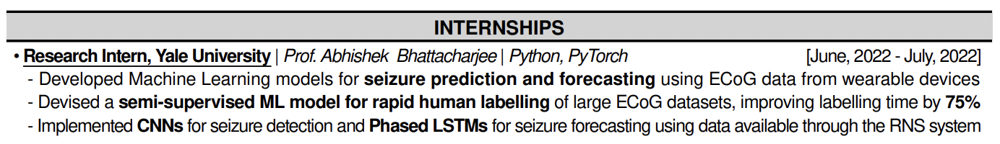
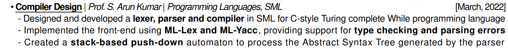

Tech CV tips

#### How important are CVs?

Honestly CVs are not that important for the internship season. Shortlisting for tests is mostly based on CGPA or JEE ranks.

Not having a good CV can be harmful but having a good/great CV doesn't help a lot (unless you have something exceptional in your CV).

CV are mostly a talking point in the interview stage and helps the company know about your skills.

#### Sections

I recommend keeping the following sections for tech/quant roles(in order):

- Academic Details
- Scholastic Achievements
- Internships
- Projects
- Technical Skills
- Extracurricular activities / PORs

#### Scholastic achievements

- I think this is something that companies look at a lot. Don't forget to mention things like JEE rank, DRs, Scholarships, Olympiads, other prizes.
- I recommend keeping this chronological / in order of importance with dates right aligned.
- Highlight the ranks, scores etc.

#### Internships

- Its a big plus having this section non empty for the internship season.
- In my experience unless you did something exceptional the exact details of your internship don't matter much.
- What to mention?
    - Where you did it?
    - What your role was?
    - Problem statement / Project goals
    - What you did?
    - What was the impact of your internship?
    - Skills / Tech stack used
- Don't give elaborate details, talk about them during the interview
- Be concise not more than 3 points
- Be sure you know about the stuff you mention

#### Projects
- Course projects / Research projects / Shorter internships that OCS doesn't allow you to write in the internships section
- Again be concise don't mention too many details
- I recommend 2-3 points per project
- Try to utilize the lines fully don't have a lot of blank spaces and wrap arounds
- Have a short title.
- What you implemented and what tools did you use to implement it? Impact if any.
- Make sure you have things to talk about during the interview and have an idea about the details.
- Highlight the keywords.

#### Technical skills

- I recommend 2-3 points with comma separated values
    - Programming Languages / Languages
    - Libraries / Frameworks / Tools
    - Certifications / Online courses

- Make sure you mention things in the correct section. Eg. Git is not a language but a tool.
- Make sure commas have proper spacing A, B, C, D ...
- Capitalize things properly eg NumPy, TensorFlow, GitHub etc.

#### PORs / Extracurriculars

- Not that important for tech roles you can mention 2-3 points
- Try to write points that highlight your soft skills (leadership/communication/creativity)

#### Things to keep in mind
- Get your CV reviewed by multiple people
- Spell check multiple times and use Grammarly if needed
- Keep things consistent. Eg. All project titles should be consistent, All dates should be consistent, all sorts of formatting should be consistent
- Be concise
- Align things properly
- Highlight the keywords
- Be ready to speak about / answer questions anything you mention in your CV
- Make CVs specific to the role. You can save mutliple CVs and choose the right one according to the role you apply to
- Keep project titles short
- Don't forget to fetch and add points on the second page
- Don't repeat the same words a lot
- Use ChatGPT to word project descriptions better

